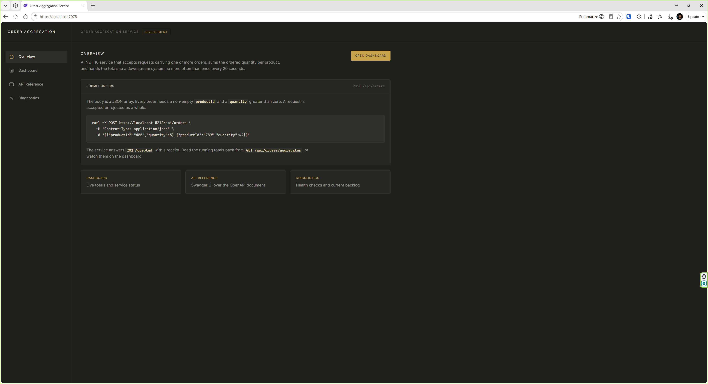
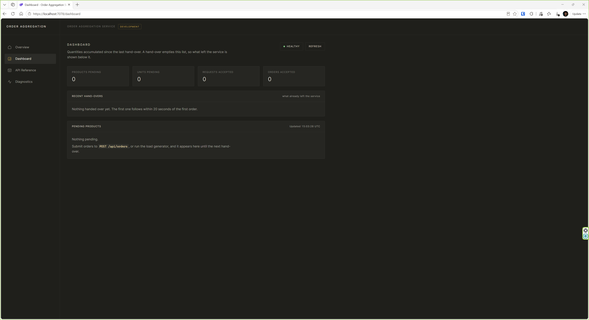
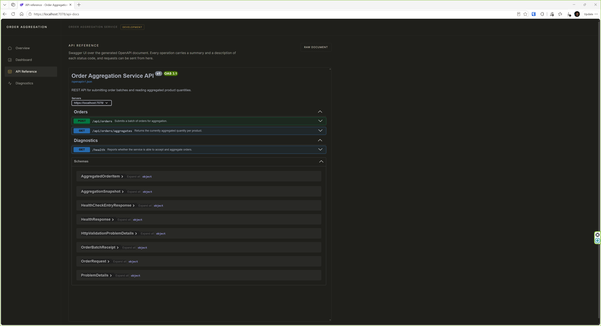
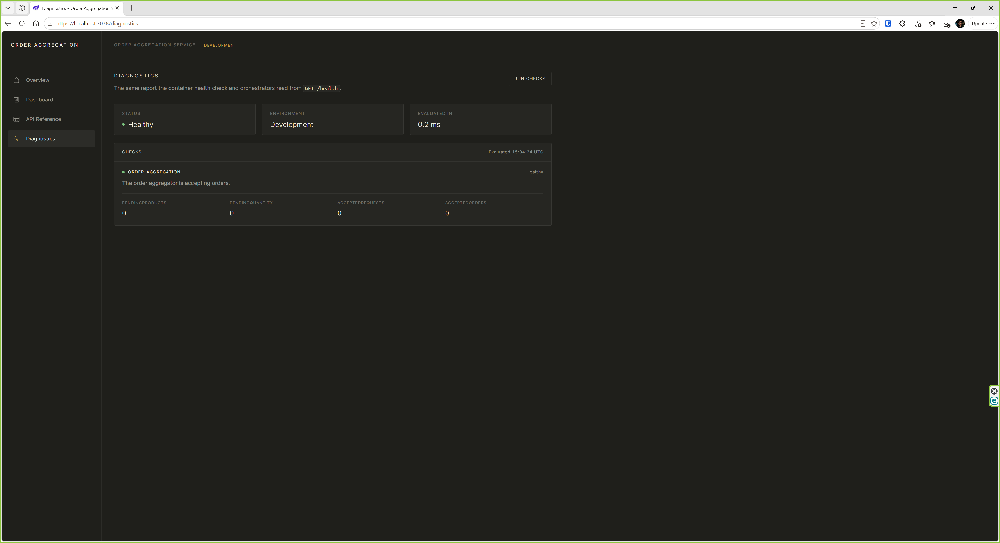
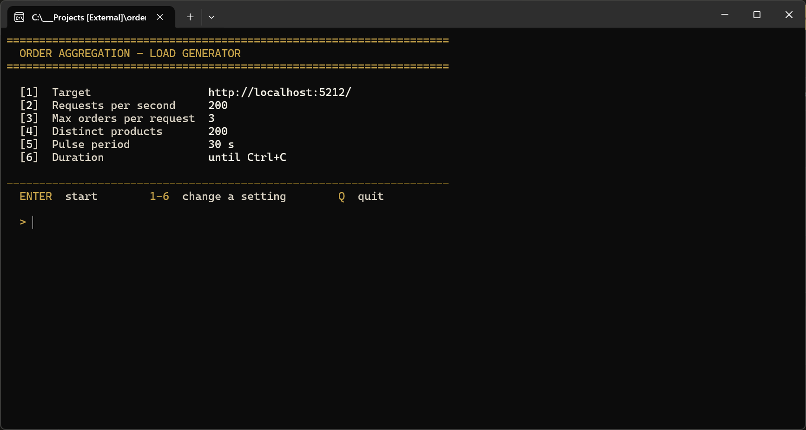

# Order Aggregation Service

[](https://github.com/vlastimilvajnorak/order-aggregation-service/actions/workflows/ci.yml)
[](LICENSE)

A .NET 10 service that accepts batches of orders over HTTP, accumulates the ordered
quantity per product in a thread-safe store, and exposes the running totals through a REST API
and a small Blazor dashboard. The aggregate is prepared to be handed over to a downstream
system by a periodic dispatch pipeline.

## Project status

Every requirement in [docs/requirements.md](docs/requirements.md) is implemented and covered by
tests: order submission and validation, per-product accumulation, the hand-over on a minimum
20-second interval, and a store selected through configuration. The hand-over writes the
aggregated payload to the console as JSON, standing in for a downstream integration that does
not exist yet. See [Future improvements](#future-improvements) for what a production rollout
would still need.

## Technology stack

| Concern | Choice |
| --- | --- |
| Language | C# 14, the latest version `net10.0` supports (`LangVersion` pinned) |
| Runtime | .NET 10 (`net10.0`) |
| Web framework | ASP.NET Core Minimal APIs |
| UI | Blazor Web App with interactive server components |
| API documentation | Built-in OpenAPI (`Microsoft.AspNetCore.OpenApi`) with Swagger UI |
| Testing | xUnit, `WebApplicationFactory` integration tests |
| Container | Multi-stage Dockerfile, non-root runtime user |
| CI | GitHub Actions |

Cross-cutting build settings live in `Directory.Build.props` (nullable reference types,
implicit usings, deterministic builds, .NET analyzers, warnings as errors) and all NuGet
versions are pinned centrally in `Directory.Packages.props`.

## Architecture overview

The service is a single deployable ASP.NET Core application that hosts both the REST API and
the Blazor UI. Inside it, three seams keep the layers independent:

```
HTTP request
     │
     ▼
Endpoints/OrderEndpoints ──▶ Endpoints/OrderBatchValidator   (pure validation, no HTTP context)
     │                              │
     │                              ▼
     │                       Models/Order                (validated domain value)
     ▼
Services/IOrderAggregator  ◀── the only contract the API layer depends on
     │
     └── Services/OrderAggregatorBase       (all accumulation semantics, one lock)
             │                                 abstract: Restore / PersistAccepted / PersistCleared
             └── Services/InMemoryOrderAggregator   (the only store that ships; overrides nothing)
     │
     ▼
Services/OrderDispatchBackgroundService ──▶ Services/IOrderDispatcher
     │                                             │
     │                                             └── Services/ConsoleOrderDispatcher
     ▼
Services/IDispatchHistory ──▶ Services/InMemoryDispatchHistory   (recent hand-overs, bounded)
```

- **`IOrderAggregator`** is the single aggregation contract. Every member is asynchronous and
  takes a `CancellationToken`, so replacing `InMemoryOrderAggregator` with a database-backed or
  distributed implementation is a registration change in
  `OrderAggregationServiceCollectionExtensions` — the endpoints and the Blazor components do
  not change.
- **`OrderAggregatorBase`** holds the whole accumulation algorithm and leaves exactly two
  steps to the derived store: where state comes from at startup and what happens after it
  changes. A dictionary of per-product counters is guarded by a single
  `System.Threading.Lock`; the critical sections are a few integer additions, which keeps
  contention negligible while making snapshots and drains genuinely atomic. Because the
  summing and the locking live in the base, a new store cannot accidentally change *how*
  quantities aggregate — only *where* they are kept.
- **`OrderStorageType`** selects the store from configuration, so adding a durable
  implementation is a new enum member, a branch in the registration and a subclass. See
  [Persistence](#persistence).
- **`IDispatchHistory`** keeps the last 20 hand-overs so the dashboard can still show them
  after the drain has emptied the aggregate.
- **`IOrderDispatcher`** is the seam for the eventual downstream integration. The background
  service drains the aggregate once every 20 seconds and hands the result over; the shipped
  `ConsoleOrderDispatcher` serializes that payload to the console as JSON.
- **Validation** is a pure function returning either the projected domain orders or an error
  dictionary shaped for `ValidationProblemDetails`, so it is unit tested without an HTTP host.
- **Errors** are split by path: requests under `/api` produce RFC 9457 problem details, while
  browser traffic gets the Blazor error and not-found pages.

## Repository structure

```
.
├── .agents/skills/                # Canonical agent skills, read directly by Codex
├── .claude/skills/                # Generated mirror for Claude Code, do not edit
├── .github/workflows/
│   ├── ci.yml                     # Build and test on every push and pull request
│   └── pr-policy.yml              # Enforces that master only accepts PRs from develop
├── docs/
│   ├── requirements.md            # Authoritative specification and acceptance criteria
│   ├── ai-agent-development.md    # How Codex and Claude Code are configured
│   └── screenshots/               # Images used by this README
├── scripts/
│   └── validate-agent-skills.py   # Validates the skills and syncs the mirror
├── src/OrderAggregationService.LoadGenerator/
│   └── Program.cs                 # Console tool that submits random order batches
├── src/OrderAggregationService/
│   ├── Components/                # Blazor layout and pages (Home, Dashboard, Error, NotFound)
│   ├── Endpoints/                 # Minimal API endpoints, validation, health endpoint
│   ├── Models/                    # Request, response and domain records
│   ├── Services/                  # Aggregator, dispatcher, background service, options, logs
│   ├── wwwroot/                   # Static assets
│   ├── Program.cs
│   ├── appsettings.json
│   └── OrderAggregationService.csproj
├── tests/OrderAggregationService.Tests/
│   ├── InMemoryOrderAggregatorTests.cs
│   ├── OrderAggregationRegistrationTests.cs
│   ├── OrderBatchValidatorTests.cs
│   ├── OrderApiIntegrationTests.cs
│   └── OrderAggregationService.Tests.csproj
├── .editorconfig
├── .dockerignore
├── .gitignore
├── AGENTS.md                      # Working agreements for AI coding agents
├── CLAUDE.md                      # Imports AGENTS.md, adds Claude Code specifics
├── Directory.Build.props
├── Directory.Packages.props
├── Dockerfile
├── docker-compose.yml
├── LICENSE
├── README.md
└── OrderAggregationService.slnx
```

## Requirements for local development

- [.NET SDK 10.0](https://dotnet.microsoft.com/download/dotnet/10.0) or newer
- Optionally Docker (Engine 20.10+) to build and run the container
- Any editor with C# support: Visual Studio 2026, VS Code with the C# Dev Kit, or JetBrains
  Rider

## Running the application

```bash
dotnet run --project src/OrderAggregationService
```

The launch profiles bind to `http://localhost:5212` and `https://localhost:7078`. Once the app
is up:

| Address | What it serves |
| --- | --- |
| `/` | Landing page with a quick-start example |
| `/dashboard` | Interactive server-rendered dashboard, refreshing every two seconds |
| `/swagger` | Swagger UI, backed by the generated OpenAPI document |
| `/openapi/v1.json` | OpenAPI document |
| `/health` | Health report as JSON |

## Screenshots

**Overview** - the landing page: what the service does, a copy-paste example request, and
links into the rest of the app.



**Dashboard** - live totals accumulated since the last hand-over. The tiles show pending
products and units plus the lifetime counters, and the table pages through the pending
products with a page size computed from the viewport.



**API reference** - Swagger UI over the generated OpenAPI document, restyled to match the
shell. Every operation carries a summary and per-status response descriptions, and requests
can be sent directly from the page.



**Diagnostics** - the same report the container health check reads from `GET /health`:
aggregated status, every individual check, and the current backlog.



**Load generator console** - the interactive start menu of the testing tool. Not part of the
assignment; see [Generating load](#generating-load) for why it exists and what it does.



## Running the tests

```bash
dotnet test
```

The suite mixes unit tests over the aggregator and the validator with `WebApplicationFactory`
integration tests over the real HTTP pipeline. Each integration test boots and disposes its own
application instance, so no state is shared between tests and the suite is order independent.

To reproduce the full local verification the CI pipeline is derived from:

```bash
dotnet restore
dotnet build --configuration Release --no-restore
dotnet test --configuration Release --no-build
dotnet format --verify-no-changes
```

## Generating load

> The load generator is not part of the assignment. It exists because the assignment's
> constraints cannot be verified by hand: proving the 20-second hand-over floor, exact
> totals under concurrency, and behaviour at hundreds of requests per second requires
> sustained, controllable traffic. It doubles as the quickest way to see the dashboard
> live.

A console tool submits random order batches, so the hand-over, the dashboard and the
aggregate have realistic traffic. Start the service first, then:

```bash
dotnet run --project src/OrderAggregationService.LoadGenerator
```

It opens a start menu where every setting can be changed before the run, and the run
screen then rewrites its counters in place rather than scrolling a log:

```text
====================================================================
  ORDER AGGREGATION - LOAD GENERATOR
====================================================================

  [1]  Target                  http://localhost:5212/
  [2]  Requests per second     200
  [3]  Max orders per request  3
  [4]  Distinct products       200
  [5]  Pulse period            30 s
  [6]  Duration                until Ctrl+C

--------------------------------------------------------------------
  ENTER  start          1-6  change a setting          Q  quit
```

Traffic pulses rather than running flat: a wave over the pulse period moves the rate
between a fifth and the full figure, with random jitter on top, so the dashboard and the
hand-overs show load rising and falling the way real producers behave. `--pulse 0`
restores a constant rate.

Every setting is also a command-line flag for unattended runs, where the menu is skipped
and only the final tally is printed:

```bash
dotnet run --project src/OrderAggregationService.LoadGenerator -- --rps 300 --products 250 --duration 60
```

Defaults match the design target of hundreds of small orders per second over a catalogue
of hundreds of products, running until interrupted. `--help` lists every option.

While it runs, the service logs one hand-over per 20-second interval, and the units in
those hand-overs add up to exactly what the generator submitted.

## Running with Docker (optional)

The assignment does not ask for Docker; the image is provided as a deployment option, not as
part of the required delivery.

```bash
docker compose up --build
```

The service is then reachable on `http://localhost:8080`. To build and run the image directly:

```bash
docker build --tag order-aggregation-service:local .
```

```bash
docker run --rm --publish 8080:8080 order-aggregation-service:local
```

The runtime image drops to the non-root `app` user provided by the .NET base image and declares
a `HEALTHCHECK` that probes `/health`.

## API

| Method | Route | Purpose | Success |
| --- | --- | --- | --- |
| `POST` | `/api/orders` | Submit a batch of orders for aggregation | `202 Accepted` |
| `GET` | `/api/orders/aggregates` | Read the current aggregate | `200 OK` |
| `GET` | `/health` | Health report | `200 OK`, `503` when unhealthy |
| `GET` | `/openapi/v1.json` | OpenAPI document | `200 OK` |
| `GET` | `/swagger` | Swagger UI over that document | `200 OK` |

### Validation rules

A submitted request is rejected as a whole when any rule is violated, and nothing it carried
is aggregated:

- the body must be a JSON array with at least one order;
- `productId` must be present and must not be empty or whitespace;
- `productId` must not exceed `OrderAggregation:MaxProductIdLength` characters (64 by
  default) - every distinct identifier costs an entry until the next hand-over, so the length
  of what a caller sends must not decide how much the service holds;
- `quantity` must be greater than zero;
- the request must not exceed `OrderAggregation:MaxOrdersPerRequest` orders (1000 by default).

### Error contract

Every failing response under `/api`, `/health` and `/openapi` is RFC 9457 problem details with
a `traceId` that correlates it with the server logs - including the statuses the framework
produces itself, which reach the client with an empty body unless something writes one.

| Status | When | Body |
| --- | --- | --- |
| `400` | A rule above was violated | `errors` keyed `request`, or `[index].productId` / `[index].quantity` |
| `400` | The body could not be read as JSON at all | `detail` says what was expected |
| `404` / `405` | No such API resource, or the wrong method | `detail` |
| `413` | The body exceeded the request size limit | `detail` |
| `415` | `Content-Type` was not `application/json` | `detail` |
| `500` | A fault inside the service | `traceId` only |

A malformed body is a **400, never a 500**. `RouteHandlerOptions.ThrowOnBadRequest` is pinned
to `false` rather than left at its default, which is `true` in Development and `false`
elsewhere: otherwise the same request is an exception on a developer machine and a plain 400
in production, and the environment that is hardest to reproduce is the one that explains less.
Reporting a caller's mistake as a server fault would also bury real faults in the logs.

Every status in this table is declared on the endpoint and carries a written description in
the OpenAPI document, so Swagger UI shows the contract rather than a bare status code.

### Example request

```bash
curl -i -X POST http://localhost:5212/api/orders \
  -H "Content-Type: application/json" \
  -d '[{"productId":"456","quantity":5},{"productId":"789","quantity":42}]'
```

### Expected response

`202 Accepted`, with a `Location` header pointing at `/api/orders/aggregates`:

```json
{
  "batchId": "019906f2-9c1e-7a3d-8f41-2b7c5d3e9a10",
  "acceptedOrderCount": 2,
  "acceptedQuantity": 47,
  "receivedAtUtc": "2026-08-25T10:00:00+00:00"
}
```

Reading the aggregate back:

```bash
curl http://localhost:5212/api/orders/aggregates
```

```json
{
  "generatedAtUtc": "2026-08-25T10:00:05+00:00",
  "productCount": 2,
  "totalQuantity": 47,
  "acceptedRequestCount": 1,
  "acceptedOrderCount": 2,
  "items": [
    {
      "productId": "456",
      "totalQuantity": 5,
      "orderCount": 1,
      "firstSeenUtc": "2026-08-25T10:00:00+00:00",
      "lastUpdatedUtc": "2026-08-25T10:00:00+00:00"
    },
    {
      "productId": "789",
      "totalQuantity": 42,
      "orderCount": 1,
      "firstSeenUtc": "2026-08-25T10:00:00+00:00",
      "lastUpdatedUtc": "2026-08-25T10:00:00+00:00"
    }
  ]
}
```

An invalid batch produces `400 Bad Request` as RFC 9457 problem details:

```json
{
  "type": "https://tools.ietf.org/html/rfc9110#section-15.5.1",
  "title": "Invalid order batch",
  "status": 400,
  "detail": "One or more orders were rejected.",
  "errors": {
    "[0].quantity": ["quantity must be greater than zero."],
    "[1].productId": ["productId is required and must not be empty."]
  }
}
```

## Configuration

Two sections, each bound to its own options class and overridable with environment variables
using `Section__Key`.

`OrderAggregation` - the aggregation and hand-over pipeline:

| Key | Default | Meaning |
| --- | --- | --- |
| `DispatchEnabled` | `true` | Runs the periodic hand-over. Switch off only to isolate the API |
| `DispatchInterval` | `00:00:20` | **Minimum** interval between two hand-overs |
| `MaxOrdersPerRequest` | `1000` | Maximum number of orders accepted per request |
| `MaxProductIdLength` | `64` | Maximum length of a product identifier |

`OrderPersistence` - which provider backs the aggregate and what it needs:

| Key | Default | Meaning |
| --- | --- | --- |
| `Provider` | `InMemory` | The persistence provider. See [Persistence](#persistence) |
| `ConnectionString` | *(empty)* | Required by any provider other than `InMemory`; supply it from the environment or a secret store, never from a committed file |
| `TableName` | `OrderAggregates` | Table a database provider accumulates into |

Persistence has its own section because a provider brings settings that mean nothing to the
rest of the service. Every value is validated at startup with `ValidateOnStart()`, so a
misconfigured interval, an unknown provider, or a provider selected without a connection
string fails the host immediately rather than at the first request.

Logging is structured: production writes JSON to the console with scopes included, development
uses the single-line readable formatter. Log messages are generated at compile time with
`[LoggerMessage]`, so their named placeholders reach structured sinks as separate fields.

## Persistence

The assignment asks for the persistence mechanism to be **extensible and configurable**, and
states that an in-memory implementation is sufficient. Both halves are delivered, and
deliberately no more than that: what is extensible here is the **abstraction**, not a second
concrete store nobody asked for.

- **`OrderAggregatorBase`** is abstract. It owns the entire accumulation algorithm - the
  dictionary, the lock, the counters, the drain - and leaves exactly three steps to a store:

  | Hook | Called | What a database provider would do |
  | --- | --- | --- |
  | `Restore()` | once, before the first operation | `SELECT` the products and the counters |
  | `PersistAccepted(orders)` | after a request has been accumulated | upsert the deltas: `quantity = quantity + @delta` |
  | `PersistCleared()` | after a hand-over has emptied the aggregate | `DELETE` the accumulated rows |

- **`InMemoryOrderAggregator`** overrides none of them. It is a constructor and nothing else,
  which is the point: the default and fastest store carries no persistence code at all.
- **`DatabaseOrderAggregator`** is a skeleton showing exactly how far a provider reaches: it
  overrides the three hooks and nothing more. Its hooks throw, and their documentation states
  the statement each would run. It exists so the extension point is demonstrable rather than
  asserted - **it is not an implementation**, and the solution takes no data-access dependency.
- **`OrderPersistenceOptions`** / **`OrderStorageType`** bind the choice to the
  `OrderPersistence` configuration section and validate it at startup.

Selecting a provider is configuration only:

```json
"OrderPersistence": {
  "Provider": "Database",
  "ConnectionString": "Server=.;Database=orders;Trusted_Connection=True;",
  "TableName": "OrderAggregates"
}
```

Choosing `Database` without a connection string fails the host at startup with a named
message. Choosing it *with* one starts the host and fails on the first hook with an
explanation, because the skeleton fails loudly rather than pretending to be durable.

The hooks carry **deltas, not a snapshot**. That shape is chosen for the store this seam
actually exists for - a database - where an accepted request is an upsert of a few rows and a
hand-over is a delete. Handing the whole aggregate to the store on every request would force a
full rewrite and would not survive hundreds of requests per second over hundreds of products.

Implementing that provider is therefore: fill in the three hooks of
`DatabaseOrderAggregator`. The enum member, the configuration binding, the validation and the
registration branch are already there. No endpoint, no component and no API test changes -
which is what "the API layer does not know how the aggregate is stored" means in practice.

One rule a provider must not get wrong: `PersistCleared()` has to be durable. Skipping it
would let a restart resurrect orders that have already gone downstream, breaking the "counted
exactly once" invariant.

## Hand-over to the downstream system

Every 20 seconds the background service drains the aggregate and hands it to
`IOrderDispatcher`. `DispatchInterval` is a floor, not a target: a burst of submissions never
shortens it, so two hand-overs are always at least one interval apart.

The shipped `ConsoleOrderDispatcher` writes the payload as a single line of JSON:

```json
{"dispatchedAtUtc":"2026-08-26T08:00:20+00:00","productCount":2,"totalQuantity":50,"items":[{"productId":"456","quantity":8},{"productId":"789","quantity":42}]}
```

Draining clears the aggregate, so `GET /api/orders/aggregates` and the dashboard show what has
accumulated since the last hand-over. The dashboard's **Recent hand-overs** panel is what keeps
the history visible after the drain: it is fed by `IDispatchHistory`, which records each
hand-over only once the dispatcher has accepted it. Replacing the console dispatcher with a real integration
is a single registration change.

## Branching model and CI

| Branch | Role | Rules |
| --- | --- | --- |
| `develop` | Default branch, integration target | Changes only via pull request, no approvals required, all review threads must be resolved, CI must pass |
| `master` | Stable branch | Changes only via pull request **from `develop`**, no review required, CI and the source-branch check must pass |
| `main` | Not used | Creation and updates are blocked by a repository ruleset |

The `CI` workflow validates the agent skills, restores, builds in `Release` and runs the tests
on every push and pull request to `develop` and `master`, and uploads the `.trx` test results
as an artifact. The `PR policy` workflow runs only on pull requests into `master` and fails
when the source branch is not `develop`; it is registered as a required status check so the
rule cannot be skipped.

## AI agent development

Codex and Claude Code are configured from `AGENTS.md` and version-controlled skills. See
[docs/ai-agent-development.md](docs/ai-agent-development.md).

## Future improvements

Deliberately not implemented here: for the scope of this assignment they would be
overengineering, but a production deployment would ask for most of them. Grouped by the
problem they solve.

### Reliability of the hand-over

- **Delivery guarantee.** The cycle drains and then dispatches, so a hand-over that throws
  loses that batch. Production wants peek-send-commit, or an **outbox**: persist the drained
  batch first, mark it sent after the downstream acknowledges, and replay unsent batches on
  startup.
- **Retries with backoff and a circuit breaker** around the downstream call (Polly or
  `Microsoft.Extensions.Resilience`), plus a **dead-letter path** for batches that keep
  failing, so one poisoned hand-over cannot stall the schedule.
- **Idempotent hand-over.** Attach a batch id the downstream can deduplicate on, so a retry
  after an ambiguous timeout cannot double-count an entire interval.

### Timeouts and back-pressure

- **Explicit timeouts everywhere.** `HttpClient.Timeout` plus a per-attempt timeout for the
  dispatcher, and request timeouts on the API (`Microsoft.AspNetCore.Http.Timeouts`). A call
  without a deadline eventually holds a thread, a socket, or a lock for someone else.
- **Kestrel limits.** Cap request body size, concurrent connections and header sizes to shed
  malformed or hostile traffic before it reaches the pipeline.
- **Rate limiting and back-pressure.** ASP.NET Core rate limiting per client, answering
  `429 Too Many Requests` with `Retry-After`, so a misbehaving producer degrades itself
  rather than the service. Under sustained overload prefer rejecting early to queueing
  unboundedly.
- **Graceful shutdown.** Deadline-bound drain on `SIGTERM`: stop accepting, hand over what
  accumulated, then exit, so a rolling deploy loses nothing.

### Scaling beyond one instance

A single instance holds the whole aggregate in memory, so it is the unit of failure and the
ceiling of scale. Two honest paths out:

- **Vertical first.** The measured cost per order is a dictionary add under a short lock; one
  instance sustains the specified hundreds per second with headroom. Scaling up is the
  cheapest correct answer until the numbers say otherwise.
- **Horizontal with shared state.** Replicas must aggregate into a shared store (Redis
  `HINCRBY`, or a database upsert) instead of process memory, and exactly one instance may
  run the 20-second hand-over: leader election or a distributed lock
  (`RedLock`, `LeaseContainer`, or a Kubernetes `Lease`). Sticky routing is not enough,
  because the dispatch cadence is global, not per-replica.
- **Kubernetes deployment.** Readiness and liveness probes split (the app already serves
  `/health`), `Deployment` with a `PodDisruptionBudget`, resource requests and limits,
  horizontal pod autoscaling on CPU or on a custom backlog metric, and the hand-over moved
  to the leader only. The container image is already non-root with a health check, which is
  most of the admission-policy work.
- **Queue-fronted intake.** If producers outgrow synchronous HTTP, put the endpoint in front
  of a broker (Azure Service Bus, RabbitMQ, Kafka) and let consumers aggregate. This buys
  buffering and replay at the price of eventual consistency and an operations burden - it is
  the step to take when measurements demand it, not before.

### Operability

- **OpenTelemetry** traces and metrics: accepted and rejected batches, backlog size, dispatch
  latency and failures, exported to the monitoring stack, with alerts on a growing backlog
  and on missed hand-over intervals.
- **Structured audit of hand-overs.** Persist a compact record of every dispatched batch id
  and its totals, so a dispute with the downstream system is answerable from data.
- **Liveness vs readiness.** Split the single health check once external dependencies exist:
  liveness stays cheap and local, readiness reflects the store and the downstream.
- **Container hardening.** Chiselled or distroless runtime image and a dependency-free health
  probe instead of curl.

### API surface

- **Authentication and authorisation** (API keys or client-credential OAuth) - the endpoint
  is currently open by design.
- **Client idempotency keys** on `POST /api/orders`, so a retried submission cannot be
  counted twice.
- **API versioning** before the first external consumer, so the contract can evolve without
  breaking them.

## About this repository

This repository is an implementation of a technical assignment. It is a personal project and is
not affiliated with, endorsed by, or an official product of any company.

## License

Released under the [MIT License](LICENSE).
